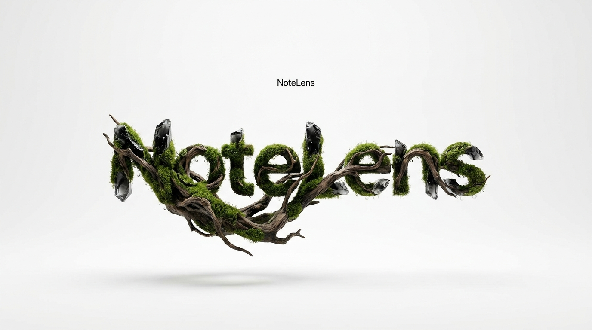
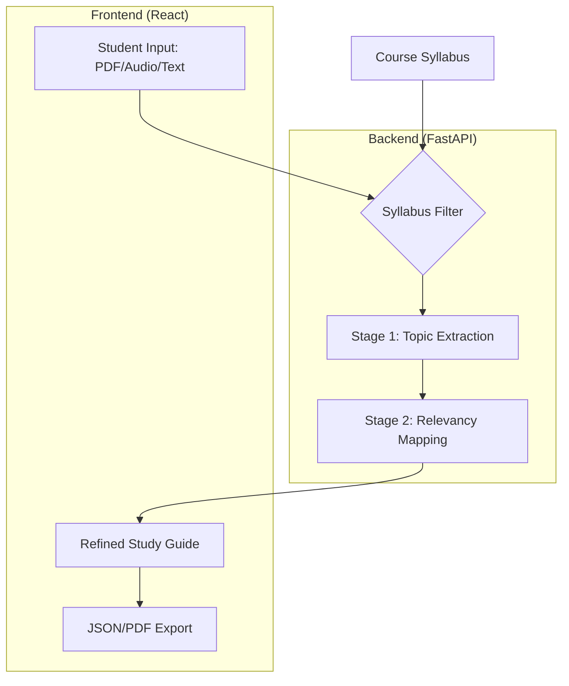

# CodeLens: The Intelligent Syllabus-Aware Study Engine

<div align="center">
  
  
  <h3>Transforming Academic Chaos into Curriculum Clarity</h3>

  [](https://opensource.org/licenses/MIT)
  [](https://www.python.org/downloads/)
  [](https://fastapi.tiangolo.com/)
  [](https://reactjs.org/)
  [](https://tailwindcss.com/)
  [](https://www.docker.com/)
</div>

---

## 🌟 The Vision

**CodeLens** is not just another GPT wrapper. It is a precision tool for students. By leveraging Large Language Models, it solves the "Information Overload" problem in academia. It takes your messy lecture notes and cross-references them with your official course syllabus, leaving you with only what matters for your exams.

---

## 📸 Visual Tour

<div align="center">
  <table>
    <tr>
      <td width="50%">
        <br>
        <sub><b>Feature-Rich Dashboard</b>: Manage your documents with a clean, glassmorphism-inspired UI.</sub>
      </td>
      <td width="50%">
        <br>
        <sub><b>The Syllabus Filter</b>: Intelligent mapping of notes to curriculum topics.</sub>
      </td>
    </tr>
  </table>
</div>

---

## 🏗 System Architecture

The following diagram illustrates the two-stage processing pipeline that ensures maximum accuracy and minimal noise.



---

## 🛠 Project Organization

We follow a professional monorepo structure designed for scalability:

```text
.
├── backend/            # Python 3.10+ API
│   ├── app/            # Core Business Logic
│   ├── alembic/        # Database Schema Evolution
│   └── tests/          # Robust Testing Suite
├── frontend/           # Vite + React + Tailwind
│   ├── src/            # Reusable UI Components
│   └── public/         # Optimized Assets
├── docs/               # PRD, Architecture, and API Guides
└── docker-compose.yml  # One-click deployment environment
```

---

## 🚦 Getting Started

### 1. Environment Setup
Clone the repo and create your local environment:
```bash
git clone https://github.com/AnandUpadhyay2510/CodeLens.git
cd CodeLens
cp .env.example .env
```

### 2. Quick Installation
We use a unified management script to handle both ecosystems:
```bash
npm run setup
```

### 3. Launch Development Mode
```bash
npm run dev
```
*   **Web Portal**: `http://localhost:5173`
*   **API Documentation**: `http://localhost:8000/docs`

---

## 🎨 Creative Roadmap

- [ ] **Voice-to-Syllabus**: Real-time lecture processing and filtering.
- [ ] **Collaborative Nodes**: Shared syllabus mapping for study groups.
- [ ] **Canvas/Blackboard Integration**: Automatic syllabus syncing.

---

## 🤝 Contributing

Contributions are what make the open-source community such an amazing place to learn, inspire, and create. Any contributions you make are **greatly appreciated**.

1. Fork the Project
2. Create your Feature Branch (`git checkout -b feature/AmazingFeature`)
3. Commit your Changes (`git commit -m 'Add some AmazingFeature'`)
4. Push to the Branch (`git push origin feature/AmazingFeature`)
5. Open a Pull Request

---

<div align="center">
  <p>Built by CodeLens Team</p>
  <a href="mailto:sujalkanere9@gmail.com">Contact Us</a> • <a href="https://exp-gemini.lusion.co/motion">Website</a>
</div>
